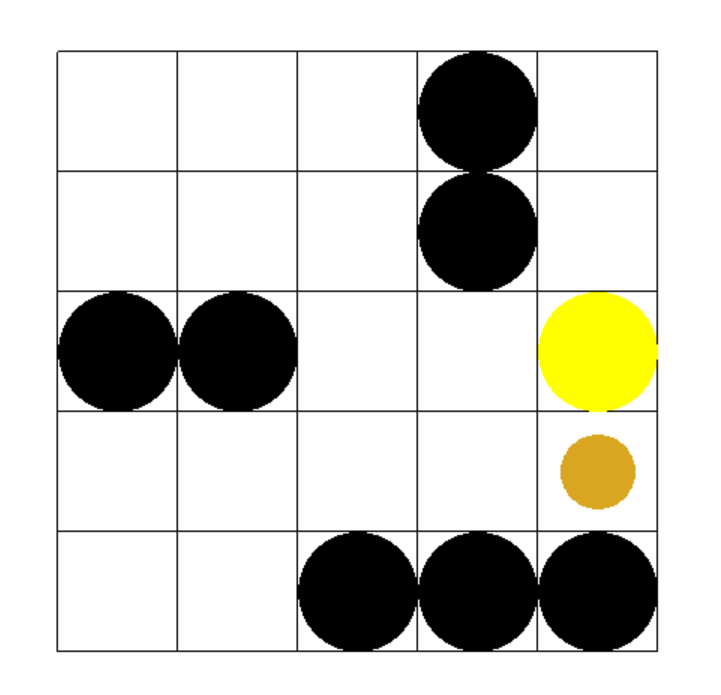

# Navigation of robot using RL algorithm

- ## environment
  - used [Gym](https://gym.openai.com/) as an environment to test algorithms.
  - The basic environment 
  
- ## algorithm
  - used algorithms of RL(Reinforcement Learning), including q-learning, sarsa
  - **comment** and **uncomment** lines in the main function of /algorithm/navigation.py to test performance of robots with different strategies

- ## output log
  - the sample logs are save in /strategy_accuracy with the format of csv
